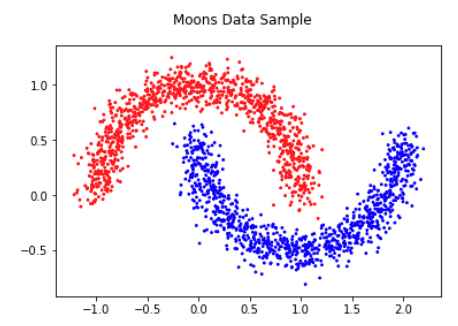
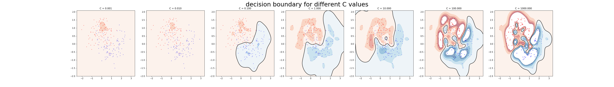
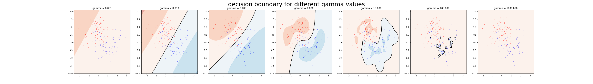
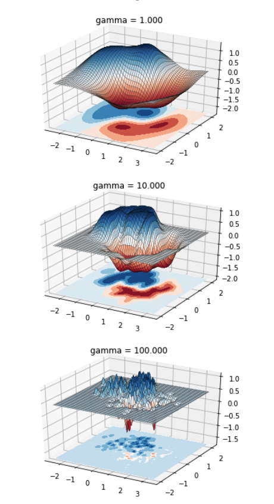

# Support Vector Machines
Yue Hu, Oct 2019

## Overview
This project explores the influence of two hyperparameters on RBF Support Vector Machines. C trades off between correctly classifing data points and maximizing the separating margin. Gamma controls the influence radius of a single data point.
The SVM is trained on a moon dataset generated by pyhton sklearn (http://scikit- learn.org/stable/modules/generated/sklearn.datasets.make_moons.html).

 

Grid search is used to tune the two parameters. For certain value pairs of gamma and C along a diagnal region, the model performs equally good. This is because smoother models, i.e., lower gamma, can be made more complex by increasing the importance of accurately classifying each point, i.e., larger C. 

A larger C penalises more on points misclassified (on the wrong side of the margin), thus encouraging a more complecated function that can better separate two class. Model with C value too large tries to fit all the noises in the training set, thus does not have the ability to generalize to common cases. As C goes larger, the countour is more and more complex to reduce misclassification, leading to overfitting. When C is too low, the model does not have the ability to distinguish between classes, and there is no countour found.

Intuitively, gamma defines how far the influence of a single training example reaches, with low values meaning ‘far’ and high values meaning ‘close’. When gamma is small, every point as supporting vector influence the whole area, thus the learned model is merely a linear hypterplane separating the center of the two classes. Whhereas for a small gamma, every point have influence only in its neighbors, and eventually shrinks to only include itself when gamma is too large.

## Structures
- `bonnerlib.py` Helper package for visualization.
- `SVM_moonDataset.ipynb` Contains data analysis example of training SVM on moon dataset.

reference:
https://scikit-learn.org/stable/auto_examples/svm/plot_rbf_parameters.html
