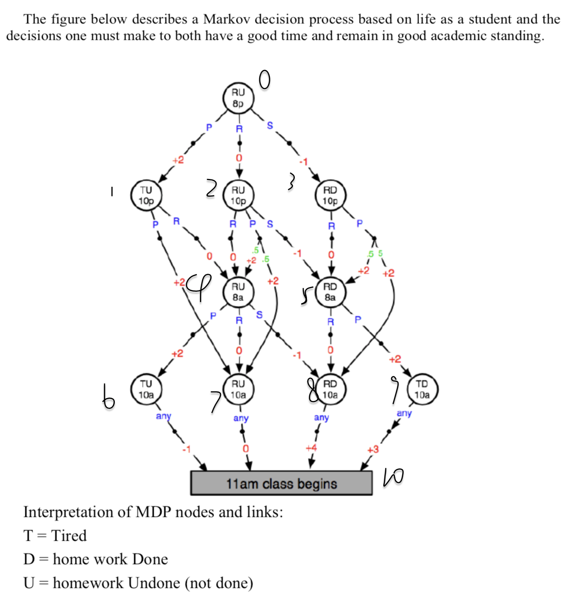

# Reinforcement Learning
Yue Hu, Oct 2019

## Overview
This repository contains the source code for Reinforcement learning from scratch. In specific, it implements the following Markov Decision Process:

Where 8p = eight o'clock pm (and so on, 10p; 8a, 10a – all denote time). Actions are P= party, R = rest and S = study. Red numbers are rewards. Green numbers are transition probabilities (all those not labeled are probability 1.0).

The code inplements a random player who chooses available actions uniform random, and outputs its experience sequence. Also policy evaluation and policy iteration methods are implemtented to find the best policy. 

## How to run
enter `python3 testing.py` in the command line. Make sure your current working path contains `testing.py` and `gridMDPmodel.py`

## Structure
- `testing.py`  The executive file containing the implementation of the party problem.

- `gridMDPmodel`  Contains the MDP model class, and the random player class.

   The gridMDPmodel class uses matrix grid to do table lookup and decides the Markov transition and the rewards of the environment. It has policy evaluaton and policy iteration methods. It has the following variables:

   - states: list of all distinct states, ordered in accordance with the matrix grid

   - actions: list of all actions, ordered in accordance with the matrix grid

   - rewards: state*acton matrix grid, real number entries. reward is nan if acrion is illegal

   - transition: state*acton matrix grid. Entries are list of (stateInd, possiblity) pairs

  The randomPlayer class chooses legal actions uniform random and can output its experience log.

- `dictMDPmodel` Contains the MDP model class, and the random player class. It is impletmentd but not used, since defining the dicitonary for a MDP is tedious.

  The gridMDPmodel class uses dicitonary to do lookup and decides the Markov transition and the rewards of the environment. It has the following variables:
	- states: list of all distinct states
	- rewards: a dectionary of (state, action) pair to a reward.
	- transition: a dicironary of (state, action) pair to (state, possibility) pair
	- legalActions: a dicitonary of State to list of legal actions
  
  The randomPlayer class chooses legal actions uniform random and can output its experience log.

