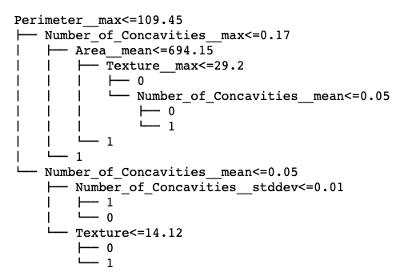

# Decision Tree
Yue Hu, Jun 2019

## Overview
This repository contains the source code for binary decision tree from scratch. The decision tree is learned by recursively splitting the mode, where the spliiting point is decided by (1) weighted Gini index, or (2) the information gain (entropy) ratio measure. The tree is fully grown  before the pruning starts. The algorithm performs an exhaustive search for the single node for which removing it (and its children) produces the largest increase (or smallest decrease) in classification accuracy as measured using validation data.

The decision tree model is tested on se the Wisconsin Diagnostic Breast Cancer (WDBC) dataset, which is downloaded from http://archive.ics.uci.edu/ml/datasets/Breast+Cancer+Wisconsin+(Diagnostic). The data analysis example is included in jupyter notebook.

## Structures
- `model.py` The source code of the binary decision tree model.
- `train_and_evaluation.ipynb` Contains data analysis example of training the decision tree on WDBC dataset.
- `Documentation for main functions.pdf` Contains the pseudocode for main functions developed in the model.
- `/cancer_datasets/` contains two datasets for training, validation and testing, with respective percentage of splitting.
