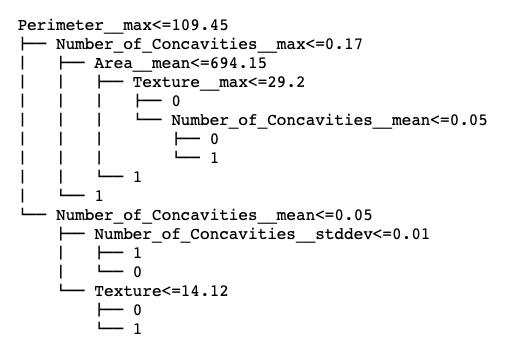
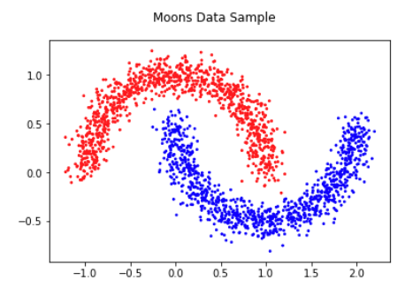
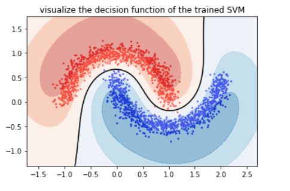
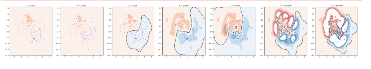
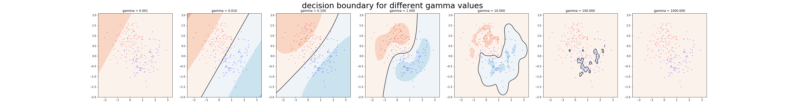
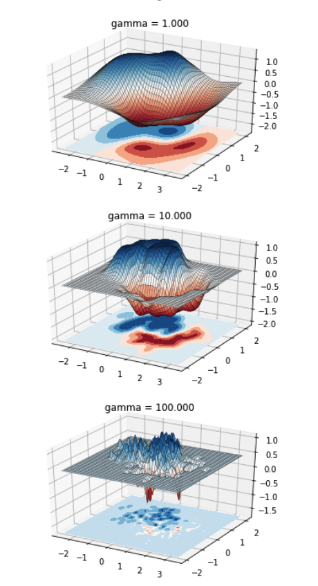
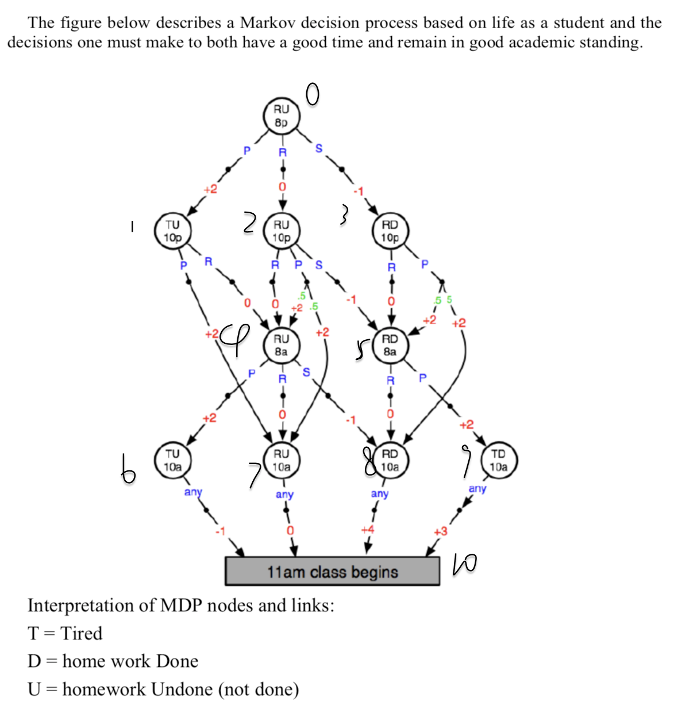

# Machine-Learning-Porjects
This repo hosts projects on Machine Learning. Most porjects are build from scratch using object oriented programming (OOP). Detailed discriptions are as below:

---
## 1. Decission Tree

([Here is the notebook] (https://github.com/yuehu9/Machine-Learning-Porjects/tree/master/1_decisionTree))

Source code for binary decision tree from scratch. The decision tree is learned by recursively splitting the mode, where the spliiting point is decided by (1) weighted Gini index, or (2) the information gain (entropy) ratio measure. The tree is fully grown  before the pruning starts. The algorithm performs an exhaustive search for the single node for which removing it (and its children) produces the largest increase (or smallest decrease) in classification accuracy as measured using validation data.

The decision tree model is tested on se the Wisconsin Diagnostic Breast Cancer (WDBC) dataset, which is downloaded from http://archive.ics.uci.edu/ml/datasets/Breast+Cancer+Wisconsin+(Diagnostic). The data analysis example is included in jupyter notebook.

## 2. Support Vector Machines

([Here is the notebook] (https://github.com/yuehu9/Machine-Learning-Porjects/tree/master/2_SVM))

This project explores the influence of two hyperparameters on RBF Support Vector Machines. C trades off between correctly classifing data points and maximizing the separating margin. Gamma controls the influence radius of a single data point.
The SVM is trained on a moon dataset generated by pyhton sklearn (http://scikit- learn.org/stable/modules/generated/sklearn.datasets.make_moons.html).

 

Grid search is used to tune the two parameters. For certain value pairs of gamma and C along a diagnal region, the model performs equally good. This is because smoother models, i.e., lower gamma, can be made more complex by increasing the importance of accurately classifying each point, i.e., larger C. 

A larger C penalises more on points misclassified (on the wrong side of the margin), thus encouraging a more complecated function that can better separate two class. Model with C value too large tries to fit all the noises in the training set, thus does not have the ability to generalize to common cases. As C goes larger, the countour is more and more complex to reduce misclassification, leading to overfitting. When C is too low, the model does not have the ability to distinguish between classes, and there is no countour found.

Intuitively, gamma defines how far the influence of a single training example reaches, with low values meaning ‘far’ and high values meaning ‘close’. When gamma is small, every point as supporting vector influence the whole area, thus the learned model is merely a linear hypterplane separating the center of the two classes. Whhereas for a small gamma, every point have influence only in its neighbors, and eventually shrinks to only include itself when gamma is too large.

## 3. Reinforcement Learining and MDP

([Here is the notebook] (https://github.com/yuehu9/Machine-Learning-Porjects/tree/master/3_ReinforcementLearning)

Reinforcement learning from scratch. In specific, it implements the following Markov Decision Process:

Where 8p = eight o'clock pm (and so on, 10p; 8a, 10a – all denote time). Actions are P= party, R = rest and S = study. Red numbers are rewards. Green numbers are transition probabilities (all those not labeled are probability 1.0).

The code inplements a random player who chooses available actions uniform random, and outputs its experience sequence. Also policy evaluation and policy iteration methods are implemtented to find the best policy. 

